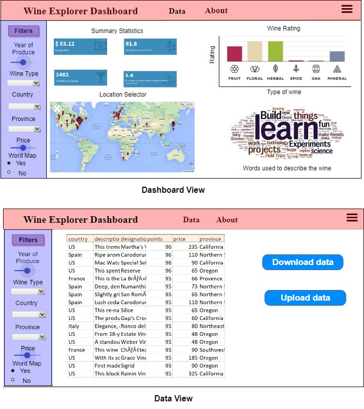

# A wine recommending application

### Link to the improved app

[https://simranubc.shinyapps.io/Wine-data-analysis/](https://simranubc.shinyapps.io/Wine-data-analysis/)

### Link to writeup for Milestone 3

[Milestone 3 writeup](https://github.com/UBC-MDS/DSCI-532-wine-data/blob/master/milestone4.md)

### Overview

Have you ever been wine shopping and wondered what wine to buy to serve for the lavish dinner you want to host? Or if the ratings actually mean anything? Do only high-priced wines get good reviews? This analysis attempts to demystify some of the confusion behind wine buying by examining a wide range of wines reviewed by a popular wine publication and showing ways to choose a wine based on other factors such as country of origin and varietal. The aim of the project is to give an overview of worldwide wine clues, for example, the relation between price and quality(points), the countries where the wines are made or perform an analysis of the most used words to describe wines.

### Description of the data

We obtained a data set of reviews for over 110,000 different wines published by Wine Enthusiast magazine between 1999 and 2017. The wines reviewed originated from 42 different countries and ranged in price from $4 to $3300. Reviews were written by at least 20 different professional wine tasters (some anonymous) and included a rating of the wine on a 100-point scale. The data has 120,000 unique wine ratings from different wine tasters across 16,000 unique wineries. The data also has important information regarding the wine such as price, the location where it was grown, in addition to the points given to it by different tasters. Other relevant information includes the type of wine being rated and the twitter handle of the wine taster if in case someone wants to reach out to the source of the rating. In addition to this, we will be calculating a score for each wine on the basis of points it has received from different tasters.

### Usage scenario and tasks

John is the kind of person who drank wine all his life and he knew that it came from grapes but didn't really know much more than that. He has a vague idea of what type of wine he likes but has no idea about the difference between a Chardonnay and a Chenin Blanc. At the liquor store, he usually buys a $10-$12 bottle with a fun label that he knows won't disappoint and won't break the bank.

So, needless to say, he was looking forward to educating himself a little. This app is built for people like John who could use a helping hand while choosing wine. It will allow people to navigate through and choose the area where they are present, the price, type and notes to find the best wine that will satisfy their taste buds.

### Description of your app

We plan to use the shiny dashboard library for a dashboard look of our app. The main dashboard view will have the word cloud and the line graph of ratings of different wines. It will also feature a world map showing the different places of which we have the wine data. The filters will include the price and variety of the wine for now. We will see if including more/different filters for our data makes sense. The app will have three tabs. The `main tab` will feature the dashboard, the second `Data` tab will have the data table of the different wines from across the world and the `About` tab will be an informational tab from where the wine enthusiasts will get information on how to use the shiny app. The `data` tab will also have a `download` and an `upload` button to use new data or to download the data which the user has filtered in the dashboard.

| **Team Members** |
| -- |
| Sreya Guha |
| Simran Sethi |

