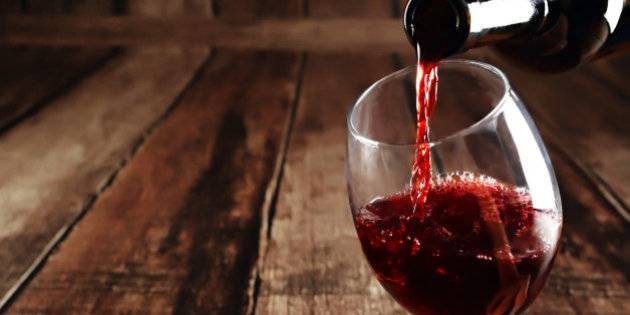

## About the app:

This app has been developed in order to help a wine connoisseur or a newbie get more information about the kinds and types of wines available around the world.

### About the filters:

1. Country filter = Filter the country you want to see in the corresponding word cloud and scatter plot.
2. Variety Filter = The type of wine variety that you want to see in the corresponding word cloud and scatter plot.
3. Grape Type filter = The type of grape data that you want to see in the corresponding word cloud and scatter plot.
2. Desired price range filter = the price range filter can be set between 2 values through this slider bar.
3. Desired rating range filter = the desired rating out of 100 can be set through this slider bar.

### About the world map:

The word map is an interactive map of the type of wines and the summary of type of wines found in the different countries across the world. When you hover over a country you will see the following data points:

1. N: the percentage of data that is available for this country
2. Country name
3. Median Points: the median points given to a wine from this country.
4. Median price: the median price of wine for a wine from this country.

### About the data:

The data has the following components:

1. `country` -> country from which the wine can be found to be originated.
2. `description` -> the text describing the type of wine
3. `designation` -> the designation of the wine taster.
4. `points` -> the number of points alloted to a particular wine on a scale of 100.
5. `price` -> the price of wine.
6. `province` -> the province in which the wine could be found.
7. `region 1` -> the regional information about the place of origin of the wine.
8. `region 2` -> second regional information.
9. `taster name` -> the name of the taster.
10. `taster twitter handle` -> the twitter handle of the taster.
11. `title` -> the title of the wine.
12. `variety` ->  the type of wine.
13. `winery` -> the winery from which it can be found to have originated.
14. `vintage year` -> the year in which it was first manufactured.

### How to use the app:

1. Select or type in the country names you would like to compare in the sidebar of the main dashboard window.
2. Select the variety of wine you would like to compare from the select button below the country input box.
3. The `data` tab displays the data after it has been filtered.

### Download the data:

You can download the data from the countries and varieties of wine you have compared by clicking on the Download data button above the data table.
