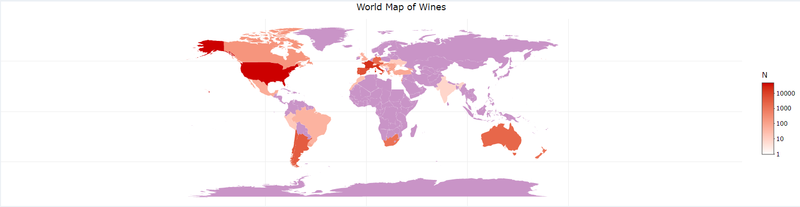
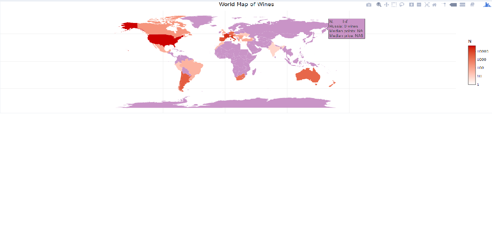
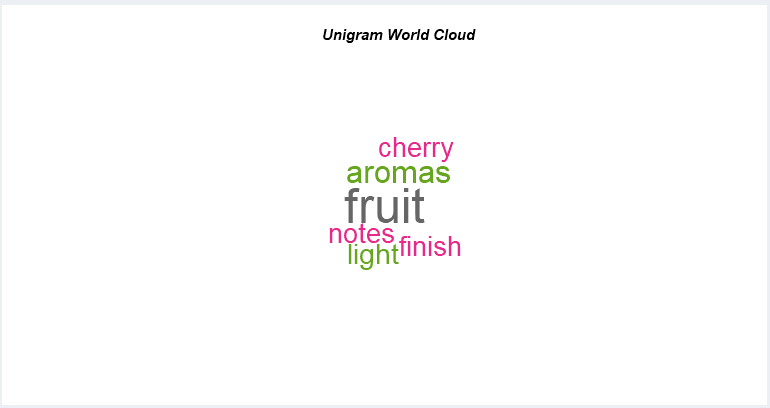
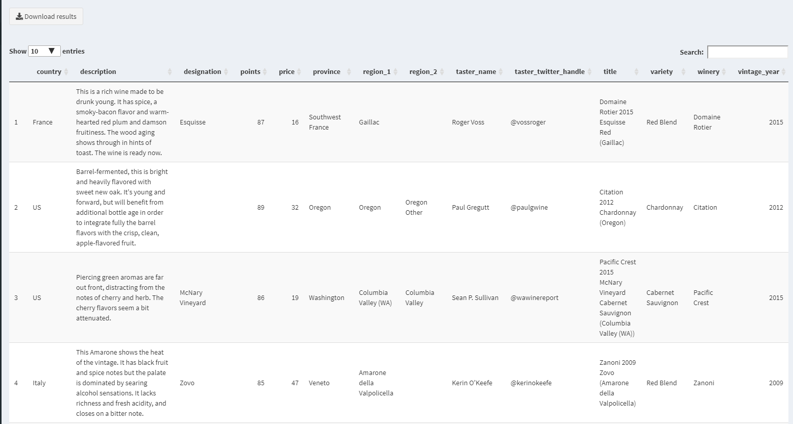
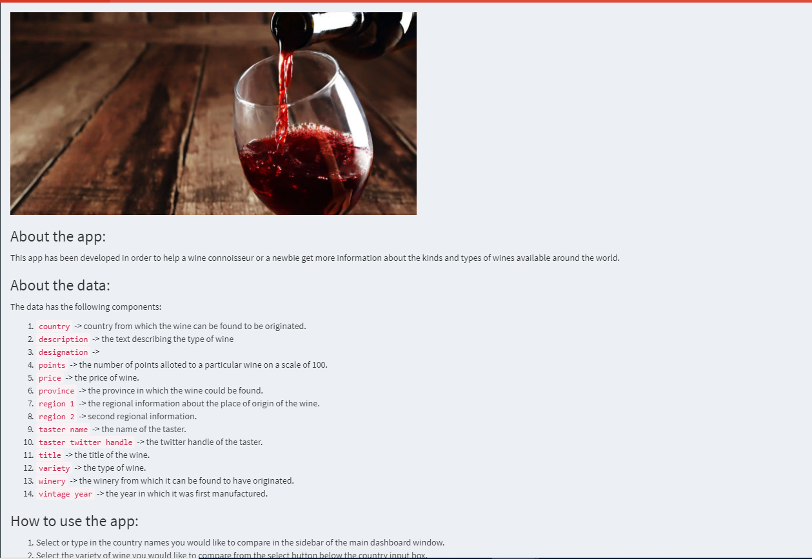

# A wine recommending application

| **Team Members** |
| -- |
| Sreya Guha |
| Simran Sethi |

**Rationale**

Have you ever been wine shopping and wondered what wine to buy to serve for the lavish dinner you want to host? Or if the ratings actually mean anything? Do only high-priced wines get good reviews? This analysis attempts to demystify some of the confusion behind wine buying by examining a wide range of wines reviewed by a popular wine publication and showing ways to choose a wine based on other factors such as country of origin and varietal. Our aim with this app is to make wine buying as enjoyable as drinking it. Thus we have used scatterplots, world maps and word clouds to help users make informed decisions about wine purchase.

**Task Plan**
The detailed steps are:

Step 1. Load data into R

Step 2. Data wrangling:

- Checking null values and drop all of them
- Cleaning the columns for outliers
- REmoving the region_2 column

Step 3. Visualizations of the dataset (EDA):

- Wordcloud of the most common words associated with a wine
- Trend between the price of wine and it's rating
- World map to show the median price and rating of wines in each country

Step 4. Building the application:

- One main tab to display the world map, world cloud and graph
- One data tab for displaying and downloading the data table
- One information tab to provide general information about the data used and the application

**Application Design**

One of the first questions we have when shopping for wine and see it's rating is to ask whether the wine will be good enough for the occasion or if it is better to spend more money and get a better wine. To better visualize the relationship between price and rating, we have plotted the rating against the wine price for the wines for each country sampled from the data set. It's no surprise that yes, higher-priced wines do tend to have higher ratings.

Another feature that we have provided is the world map that allows the user to see the median price and rating of the country that he/she has selected by hovering on the map. This also allows the user to see the most popular wine varietal from different countries around the world and each of the U.S. states that produce wines. This may be useful for travelers wishing to find the best type of wine to drink when visiting or to buy as a memorable souvenir.

We know that some users are also very keen on knowing what wine someliers have to say about certain types of wine in certain countries. This is why we have also embeded a feature to check the most commonly used words that have been used to describe the wine. These words have been taken from reviews provided by wine enthusiasts ans therefore can be trusted. The wordcloud can be filtered based on the type of wine, price, etc.

We also put together a tab to help explore the full database of wines reviewed and find the best values on wines specified by varietal, price range, etc. The user can also choose a desired rating category and search for the wines determined were the "Best Values" from my wine rating vs. price analysis. We have also provided the functionality of downloading the filtered data from the application if the user wants to keep track of wines he/she selected.

Additionally we have also included an information tab for the users of the application to gain more more information about the data used to draw conclusions and also about the utility of the application.

**Tasks for the upcoming milestone**

Our tasks for the upcoming milestone are as follows:

- Make radio button filters for the world cloud
- Segregate our wine list into "Vintage" and "Classic" wine categories
- Add a slider filter for the year of wine produce
- Speed up the loading of the dashboard to convinience of use
- Include an "upload" button for the data tab 

**Bugs to be fixed**

- The title for the worldcloud needs to made better
- The legend for the world map is meaningless
- The province filter does not filter according to the countries selected

