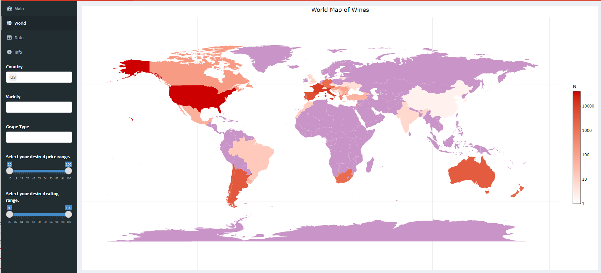

# A wine recommending application

| **Team Members** |
| -- |
| Sreya Guha |
| Simran Sethi |

**What changes did you decide to implement given the time limit, and why do you think this is the best thing to focus on?**

Given the time limit we decided to implement the following changes :

1. We added four summary statistics panels to give the users an overview of the price and type of wimes in the country of their choice

2. Learning from the confusion that the world map created for our peers, we moved the world map to another tab in the application

3. We went through the code thoroughly again to discover a fault in our code which we then fixed. This also caused our app to load a little faster

4. We changed our filters to get updated according to the "country" filter

We decided to make these changes as these features enhance the performance and usability of the application. Change 3 also made us go through our code and review it once again. This helped us in documenting our code better and also let us identify mistakes that were made and were ignored in the other milestones. Given the time lin=mit constarint we did not want to amke major changes to our app. Thus we chose changes that did not require altering the app a lot. Thus we chose to include summary statistics to make the data more clear to the users. We also chose act on the feedback that we recieved last time and move our world map to another tab to reduce confusion and make the app more user friendly.

**What would you do differently?**

Although we are pretty pleased with the way our application turned out at the end of four weeks, there are a few things that we would do differently if we had more time or we could re-do the application. Our wordcloud currently displays monograms (i.e. one-word frequencies) which are also important and do convey the message somewhat clearly; however, this arrangement can be made better. The word cloud can be made better through the use of bigrams and trigrams: patterns of two and three words appearing together. We feel that adding this option will further help in user engagement. 

Also considering how important the load time of an application is for usability and customer satisfaction, we would be more thoughful about our implementation of the world map and how that affects the loading time.

Furthermore, we are not very pleased with the way our code is formatted. We believ that our code could be written and organised better. thus given another chance to develop our application, we would make sure that our code is modularized and is easier to read and interpret.

**What were the greatest challenges you faced in creating the final product?**

Speed was a constant issue with our application. Although the world map and word cloud are features that we are extremely proud of and add a lot of value to our app, load time of the app was increased baceause of these features. We also struggled with some of the Plotly features like renaming legends and styling of the titles of plots. Thus we would have liked to have some prior knowledge about Plotly to make our tasks a litte easier. 

We also had a hard time figuring out how to incorporate a "Download" button for the "Data" tab. This was button was extremely useful for the app as we wanted to provide users the option of downloading the data for safekeeping for future use. Implementing this required a lot of research and hard work. 

We also  faced some timing issues when we tried to move the world map to a different tab. This however was fixed when we went through our code with a fine tooth comb and figured out some flaws in it. 
